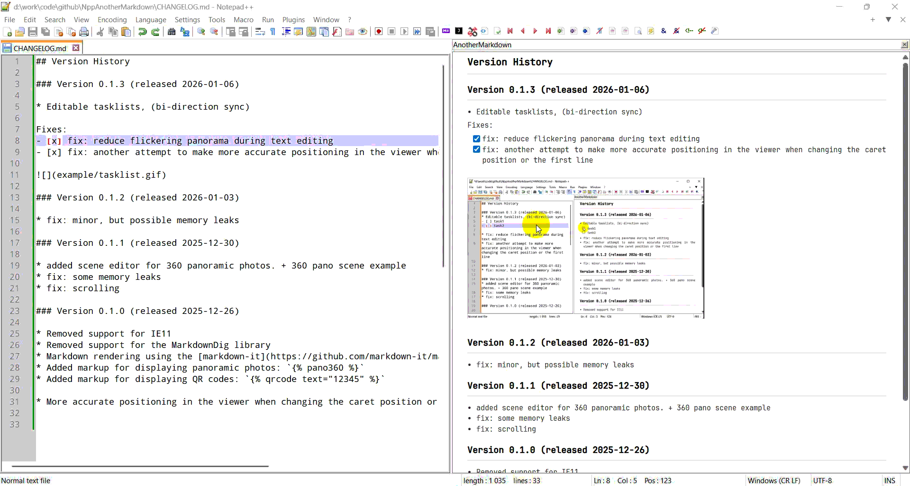

## Version History

### Version 0.1.3 (released 2026-01-06)
* Editable tasklists, (bi-direction sync)
- [ ] task1
- [ ] task2

* fix: reduce flickering panorama during text editing
* fix: another attempt to make more accurate positioning in the viewer when changing the caret position or the first line

### Version 0.1.2 (released 2026-01-03)
* fix: minor, but possible memory leaks

### Version 0.1.1 (released 2025-12-30)
* added scene editor for 360 panoramic photos. + 360 pano scene example
* fix: some memory leaks
* fix: scrolling

### Version 0.1.0 (released 2025-12-26)

* Removed support for IE11
* Removed support for the MarkdownDig library
* Markdown rendering using the [markdown-it](https://github.com/markdown-it/markdown-it) library
* Added markup for displaying panoramic photos: ``  
* Added markup for displaying QR codes: ``
  
* More accurate positioning in the viewer when changing the caret position or the first line

